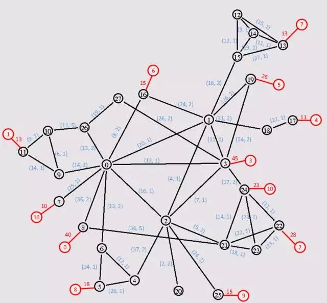
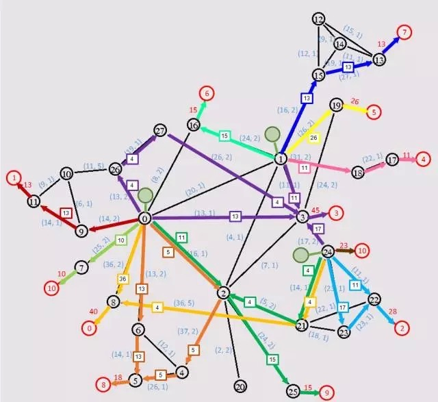
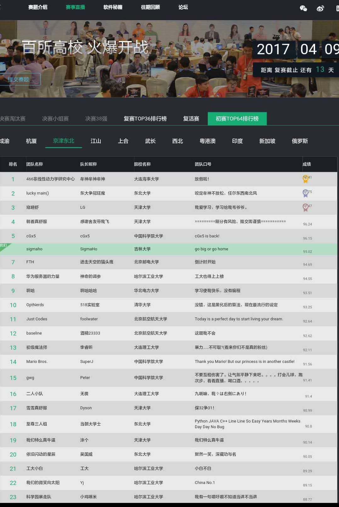
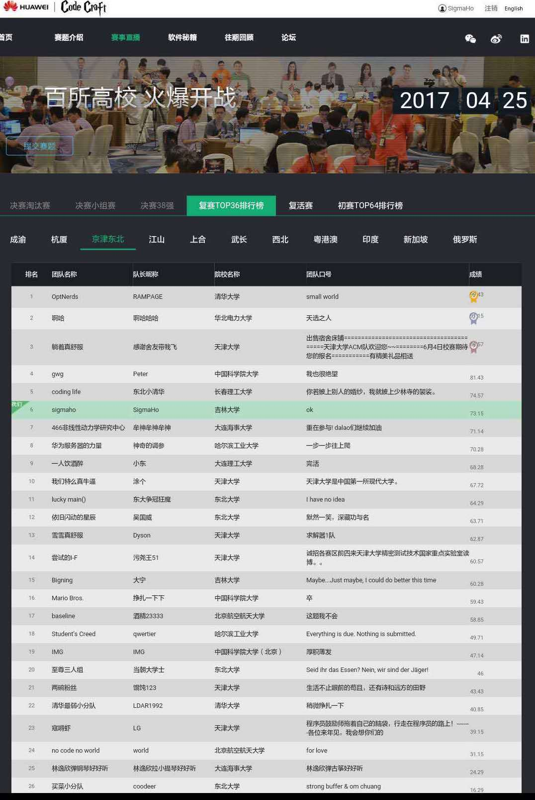

## 背景

大视频解决方案中，视频业务体验非常关键，视频内容如何有效传送到最终消费者是决定视频体验好坏的核心环节。

## 本次赛题基本描述
在给定结构的网络中（如：xx城市的电信网络），为了视频内容快速低成本的传送到每个住户小区，需要在这个给定网络结构中选择一些网络节点附近放置视频内容存储服务器。
需要解决的问题是：在满足所有的住户小区视频播放需求的基本前提下，如何选择视频内容存储服务器放置位置，使得成本最小。

## 本次赛题通用性描述

**网络结构模型：** 给定一个由若干网络节点（例如路由器、交换机）构成的网络结构无向图，每个节点至少与另外一个节点通过网络链路相连
（网络链路特指两个网络节点之间直接相连的网络通路，中间没有其他网络节点，相当于无向图中的一条边），一个节点可以将收到的数据通过网络链路传输给相连的另一个节点，
节点本身的转发能力无上限。每条链路的网络总带宽不同（例如某条链路的总带宽为10Gbps）。而每条链路承载的视频传输需要按照占用带宽的多少收取对应网络租用费，
每条链路的单位租用费均不同（例如某条链路的租用费为1,000元/Gbps，即1K/Gbps）。某条链路上被占用的带宽总和不得超过该链路的总带宽。

**消费节点：** 给定的网络结构中有部分网络节点直接连接到小区住户的网络，每个小区住户网络在这个给定的网络结构图中呈现为一个消费节点，不同消费节点的视频带宽消耗需求不同。

**视频内容服务器：**视频内容服务器存放视频内容（如：电影影片、电视剧等），视频内容服务器的视频数据流可以经由网络节点与链路构成的网络路径流向消费节点，视频内容服务器的输出能力没有上限，
可以服务多个消费节点，一个消费节点也可以同时从多台视频内容服务器获取视频流。部署一台视频内容服务器需要费用成本（例如300,000元/台，即300K/台），所有服务器的成本均相同。

 

**比赛程序内容：** 请你设计一个程序寻找最优的视频内容服务器部署方案：从网络结构模型中选择一部分网络节点，在其上/附近一对一的部署视频内容服务器，
视频内容服务器与对应的这个节点直连，与对应的这个网络节点之间的通信没有带宽限制，也没有通信成本。
提供的部署方案需要使得视频流从视频内容服务器经过一些网络节点和链路到达消费节点，满足所有消费节点的视频带宽消耗需求，并使得耗费的总成本（视频内容服务器部署成本+带宽租用成本）最低。
部署方案不仅需要包括部署视频内容服务器的节点位置，而且还要包括每个消费节点与所有视频内容服务器之间的网络路径以及路径上占用的带宽。

## 比赛胜负规则
若给定的网络拓扑模型不存在满足条件的方案，则输出无解，程序运行时间越短者胜出。若存在满足条件的方案，则成本越低者胜出。若两个方案的成本相同，则程序运行时间越短者胜出。

## 补充说明

1. 两个网络节点之间最多仅存在一条链路，链路上下行方向的网络总带宽相互独立，并且上下行方向的总带宽与网络租用费相同。
例如对于网络节点A与B之间的链路，该条链路上的总带宽为10Gbps，单位租用费为1K/Gbps，则表示A->B、B->A两个方向上的网络总带宽分别为10Gbps，并且租用费均为1K/Gbps。
如果某条数据流在该链路A->B方向的占用带宽为3Gbps，那么该数据流在该链路的租用费为3K，并且该链路A->B方向的剩余可用带宽为7Gbps。而B->A方向的剩余可用带宽不受该数据流的影响，仍为10Gbps。
2. 每个网络节点最多仅能连接一个消费节点，每个消费节点仅能连接一个网络节点。消费节点与连接的网络节点之间的链路总带宽无限大，并且网络租用费为零。
3. 网络节点数量不超过1000个，每个节点的链路数量不超过20条，消费节点的数量不超过500个。
4. 链路总带宽与单位网络租用费为[0, 100]的整数，视频内容服务器部署成本与消费节点的视频带宽消耗需求为[0,5000]的整数。
5. 部署方案中，网络路径上的占用带宽必须为大于等于0的整数。
6. “满足消费节点的带宽消耗需求”是指输出给消费节点的带宽总和不得小于该消费节点的视频带宽消耗需求。
7. 每个网络节点上最多仅可部署一台视频内容服务器

## 比赛用例示例

上图为A市网络拓扑图，黑色圆圈为网络节点，红色圆圈为消费节点，圆圈内的数字为节点编号。节点之间的连线为网络链路。链路上的标记(x, y)中，x表示链路总带宽（单位为Gbps），y表示每Gbps的网络租用费。消费节点相连链路上的数字为消费节点的带宽消耗需求（单位为Gbps）。

现在假设需要在该网络上部署视频内容服务器，满足所有消费节点的需求（注意：对于任意用例至少存在一个可行解，即在每个消费节点直接相连的网络节点上部署一台服务器）。那么一个成本较低的方案可以如下图所示，其中绿色圆圈表示已部署的视频内容服务器，通往不同消费节点的网络路径用不同颜色标识，并附带了占用带宽的大小：

但该方案的成本不一定是最低的。因此现在需要参赛者提供的程序能够针对不同的比赛用例，给出成本最低的部署方案。

**说明：**

1. 网络路径数量不得超过50000条。

2. 单条路径的节点数量不得超过1000个。

3. 不同网络路径可按任意先后顺序输出。

4. 网络节点ID与消费节点ID的数值必须与输入文件相符合，如果ID数值不存在于输入文件中，则将被视为无效结果。

5. 文本文件中出现的所有数值必须为大于等于0的整数，数值大小不得超过100000。

**最终得分机制**

比赛平台会使用N个测试用例判题，该N个测试用例分为初级、中级、高级三个等级，参赛者对于每个测试用例都会得到一个百分制分数，使用加权平均分(初级权重为0.2，中级权重为0.3，高级权重为0.5)作为该参赛者的最终得分。

## 赛题分析和资料

本次赛题可归于**“设施选址 (facility location)”**问题，广泛应用于交通、物流网络等领域，大家可以去自己学校的论文数据库搜索一些论文作为参考。

解题思路可以是先建立一个整数规划模型，然后再采用启发式的寻优方法，例如**退火算法，遗传算法，粒子群算法**等等，当然要考虑算法的复杂性以免超时。

建议大家做题时加入**计时器机制**，因为有些用例可能规模较大，无法在规定时间内找到最优解。在快要超时的时候，提交当前的寻优结果，至少保证不会得0分。

这里有一些简单的入门论文，不一定适合本次赛题，仅作为大家扩展思路的参考：

1. Caching the P2P Traffic in ISP Network. M. Ye, J. Wu , K. Xu. IEEE International Conference on Communications, 2008. ICC '08.

2. 基于模拟退火算法的逆向物流网络设计研究. 戴更新, 侯云章. 《青岛大学学报(工程技术版)》 , 2005年03期.

3. 基于遗传算法的再制造逆向物流网络随机选址模型. 孙浩. 《信息与控制》，2009年，第38卷第4期。

4. 不确定性物流网络设计的区间规划模型与算法研究. 李利华. 中南大学博士论文，2012. 

## 复赛赛题

**变化点一：通用性描述**

**视频内容服务器**：视频内容服务器存放视频内容（如：电影影片、电视剧等），视频内容服务器的视频数据流可以经由网络节点与链路构成的网络路径流向消费节点，一台视频内容服务器可以服务多个消费节点，而一个消费节点也可以同时从多台视频内容服务器获取视频流。购买一台视频内容服务器需要硬件成本，每台视频内容服务器的输出能力存在上限（例如150Gbps/台），并分为若干档次（如0，1，2三个档次），不同档次的输出能力上限与硬件成本均不同（例如档次1的服务器输出能力为100Gbps/台，硬件成本为100千元/台，档次2的服务器输出能力为150Gbps，硬件成本为200千元/台）。此外对于某个网络节点，部署一台视频内容服务器需要支付额外的部署成本（例如某个网络节点的部署成本为50千元/台），不同网络节点的部署成本可能不同。因此部署一台视频内容服务器到某网络节点的成本为该服务器硬件成本与该节点部署成本之和。

**变化点二：补充说明**

1、网络节点数量不超过10000个，每个节点的链路数量不超过10000条，消费节点的数量不超过10000个。

2、链路总带宽与网络租用费为[0, 100]的整数，视频内容服务器档次数不超过10个。视频内容服务器输出能力，网络节点的部署成本，消费节点的视频带宽消耗需求均为[0,10000]的整数。

3、以一台视频内容服务器对应网络节点为起点的所有网路路径上的占用带宽总和不得超过该台服务器的输出能力上限。

**◄****程序输入与输出****►**

 

**▌变化点三：输入文件格式**

程序输入为一个以空格分隔的文本文件，文件每行以换行符（‘\n’或者‘\r\n’）为结尾。

 

**文件格式为：**

网络节点数量 网络链路数量 消费节点数量

（空行）

服务器硬件档次ID 输出能力 硬件成本

……（如上视频内容服务器信息若干行）

（空行）

网络节点ID 部署成本

……（如上网络节点部署成本信息若干行）

（空行）

链路起始节点ID 链路终止节点ID 总带宽大小 单位网络租用费

…………….（如上链路信息若干行）

（空行）

消费节点ID 相连网络节点ID 视频带宽消耗需求

…………….（如上终端用户信息若干行）

（文件结束）

**说明：**

\1. 网络节点ID与消费节点ID均为以0为起始的连续整数。

\2. 文本中出现的所有数值均为大于等于0的整数，数值上限为1000000。

 

**▌变化点四：输入文件示例（参照第一节中的用例）**

28 45 12 // 注：28个网络节点，45条链路，12个消费节点

 

0 70 50// 注：服务器硬件档次ID为0，最大输出能力为70，硬件成本为50

1 100 100

2 150 200

 

0 50 // 注：网络节点ID为0，部署成本为50

1 50

2 50

3 120

4 80

5 120

(以下省略若干行网络节点部署成本信息)

 

0 16 8 2 // 注：链路起始网络节点ID为0，链路终止网络节点ID为16 ，总带宽为8，单位网络租用费为2

0 26 13 2

0 9 14 2

0 8 36 2

(以下省略若干行链路信息)

 

0 8 40 // 注：消费节点ID为0，相连网络节点ID为8，视频带宽消耗需求为40

1 11 13

2 22 28

3 3 45

4 17 11

5 19 26

6 16 15

7 13 13

8 5 18

9 25 15

10 7 10

11 24 23

 

**▌变化点五：输出文件格式**

程序输出为一个以空格分隔的文本文件，文件每行以换行符（‘\n’或者‘\r\n’）为结尾。

 

**文件格式为：**

网络路径数量

（空行）

网络节点ID-01 网络节点ID-02 …… 网络节点ID-n 消费节点ID 占用带宽大小 服务器硬件档次ID

…………….（如上网络路径信息若干行，每条网络路径由若干网络节点构成，路径的起始节点ID-01表示该节点部署了视频内容服务器，终止节点为某个消费节点）

（文件结束）

 

**说明：**

1. 网络路径数量不得超过300000条。

2. 单条路径的节点数量不得超过10000个。

3. 不同网络路径可按任意先后顺序输出。

4. 网络节点ID与消费节点ID的数值必须与输入文件相符合，如果ID数值不存在于输入文件中，则将被视为无效结果。

5. 文本文件中出现的所有数值必须为大于等于0的整数，数值大小不得超过1000000。

## 比赛结果

初赛

复赛

## 初赛和复赛代码

huawei code